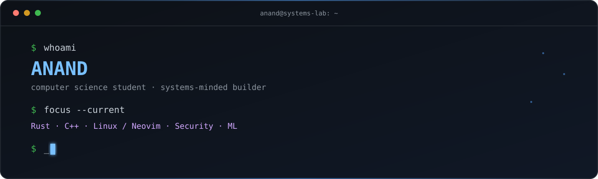

<p align="center">
  
</p>

<p align="center">
  <a href="#about">About</a> ·
  <a href="#currently-exploring">Exploring</a> ·
  <a href="#toolkit">Toolkit</a> ·
  <a href="#github-activity">Activity</a> ·
  <a href="#connect">Connect</a>
</p>

## About

I’m **Anand**, a computer science student interested in systems programming, backend engineering, networking, and the tools that make developers more effective.

I’m currently building a **Smart Code Snippet Manager** and **Beyond Borders** — a travel journaling and mapping platform. I like the patient work of understanding a system from the inside out, then making something useful with it.

When I’m away from the keyboard, I’m reading Dostoevsky or Hermann Hesse, juggling a football, or collecting a question worth following.

## Currently Exploring

```text
$ learning --in-public

Rust & C++              systems programming and multithreaded servers
Linux                   internals, processes, and the command line
Networking              HTTP and the fundamentals underneath it
Engineering             backend design, data structures, and system design
Tools                   practical workflows for builders
```

## Building
| Project | In one line |
| --- | --- |
| ***Papyrus*** | A minimal text editor written in c 
| **Smart Code Snippet Manager** | A focused place to capture, organize, and reuse useful code. |
| ***Universal Log Preprocessing Framework*** | A reusable path from noisy logs
to analysis-ready data. |


## 📊 GitHub Stats

<p align="center">


</p>

---

## 🛠️ Languages & Tools

<p align="left">
<a href="https://www.rust-lang.org/" target="_blank" rel="noreferrer">

</a>

<a href="https://www.cprogramming.com/" target="_blank" rel="noreferrer">

</a>

<a href="https://www.w3schools.com/cpp/" target="_blank" rel="noreferrer">

</a>

<a href="https://www.java.com" target="_blank" rel="noreferrer">

</a>

<a href="https://reactjs.org/" target="_blank" rel="noreferrer">

</a>

<a href="https://www.typescriptlang.org/" target="_blank" rel="noreferrer">

</a>

<a href="https://www.postgresql.org" target="_blank" rel="noreferrer">

</a>

<a href="https://git-scm.com/" target="_blank" rel="noreferrer">

</a>

<a href="https://www.linux.org/" target="_blank" rel="noreferrer">

</a>

<a href="https://aws.amazon.com" target="_blank" rel="noreferrer">

</a>
</p>

---
## Connect With Me

<p align="left">
<a href="https://twitter.com/anand" target="blank">

</a>

<a href="https://www.topcoder.com/members/226002" target="blank">

</a>
</p>

📫 Reach me at: **posidon254@gmail.com**

---

> *Code. Read. Reflect. Repeat.*
